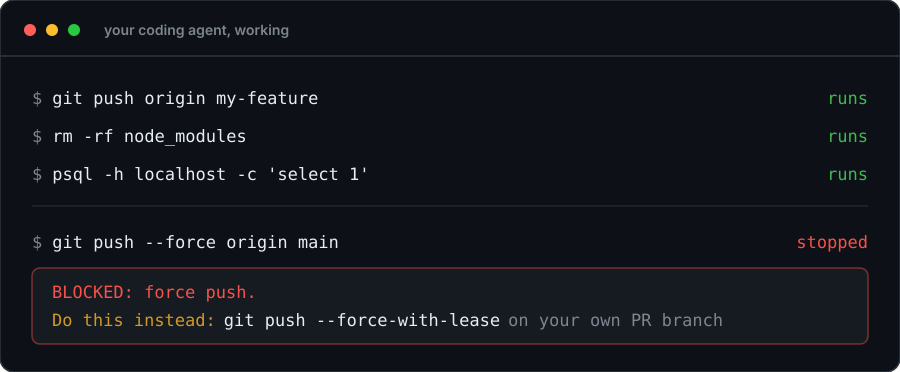

# agent-config

**Guardrails for coding agents, plus the workflow skills to keep them pointed at the right problem.**

Your agent is fast, helpful, and about one command away from force-pushing your main branch. This sits in front of every tool call it makes. Ordinary work goes straight through. The handful of commands that ruin an afternoon get stopped, and the refusal tells the agent what to run instead.

<p align="center">
  
</p>

No model call, no network, no API key. It's plain Python that reads the command and decides, so it costs about 50ms and works offline.

## Install

```bash
npx @sid-thephysicskid/agent-config@latest install
```

Restart your agent and you're done. Codex will ask you to review the new hooks in `/hooks`. Works on macOS and Linux, and needs Node 20+ and Python 3.9+.

**Don't want my skills?** Fair. They're opinionated and you may already have your own. Take the guardrails on their own:

```bash
npx @sid-thephysicskid/agent-config@latest install guard
```

That installs the hooks and nothing else: no skills directory, no instruction files, no routing. If you already have a `~/.codex`, it does wire the guard into `~/.codex/hooks.json` too, backing up your existing file first, because a guard that only covers one of your two agents is not doing its job. It's the piece I'd want on a machine even if I disagreed with everything else here.

| Command | What you get |
|---|---|
| `install guard` | Guardrails only. Nothing else touched. |
| `install` | Guardrails, the 13 workflow skills, and routing for Claude Code and Codex. |
| `install --extras` | All of the above plus `research`, `wizard`, `handoff`, and two terser output styles. |

Re-running any of them repairs or upgrades what's there. Later, `doctor` checks that the guard still *decides*, not just that it's installed:

```bash
npx @sid-thephysicskid/agent-config@latest doctor
npx @sid-thephysicskid/agent-config@latest uninstall
```

Uninstall puts everything back, including any skill of yours that was moved aside.

<details>
<summary><strong>Already have hooks, skills, or instructions set up?</strong></summary>

<br>

The installer scans before it writes, and only adds what it owns.

Your existing hooks, settings, and unrelated skills stay exactly where they are. An instruction file you already have gets one clearly marked block appended, which uninstall removes again. If a skill name collides, the default in a non-interactive install is to keep yours; in a terminal you get one prompt offering to back yours up and use this package's instead. You can decide up front with `--keep-existing` or `--replace-conflicts`. And if the install can't finish safely, it stops before wiring anything rather than leaving you half-configured.

</details>

<details>
<summary><strong>Install from source instead</strong></summary>

<br>

```bash
git clone https://github.com/sid-thephysicskid/agent-config.git
cd agent-config
./install.sh standard
```

Source installs use symlinks, so keep the checkout where it is. The npm install copies into `~/.local/share/agent-config/<version>/` instead, which is why it's the better default.

</details>

## The guard, and why it's the point

Every one of these rules exists because an agent did the thing, or came close enough to scare me.

It checks the action immediately before it runs, and every refusal names an alternative rather than just saying no:

```console
$ git push origin main
BLOCKED: pushing directly at 'main'.

Do this instead: push your feature branch and open a PR
```

It covers destructive Git, filesystem deletes, credential and key reads, production databases, and deploys that skip the pipeline. [docs/guard-coverage.md](docs/guard-coverage.md) has the full list, and the table of individual rules in it is generated from the rules themselves, so that part cannot drift from what the code does.

Two things to be straight about, because they decide whether this is useful to you:

**It's a safety net, not a security boundary.** It stops a careless agent, not a determined one. Hide a command in a variable or an inline program and it goes through. That's a deliberate line, and [every gap is written down](evals/redteam-candidates.txt) with the reason it was accepted. There are 58 of them against 98 red-team candidates, and I would rather you read that number here than discover it yourself. Keep your branch protection, least-privilege access, backups, and review.

**It fails open.** If a rule crashes, your agent keeps working and the failure gets logged where `doctor` will show it. A guard that bricks your CLI is worse than no guard.

Behind that: 1,878 test cases, of which 702 exist to prove the guard does *not* fire, plus 285 ordinary commands it may never refuse. Every rule has a case proving it fires. The allow side is not one-for-one, and it is the side I keep finding gaps in.

## The skills, and why each one exists

The package ships 13 workflow skills and 3 optional operator skills, and the reason is simple: agents love to start typing. Ask a vague question and you get code, when what you needed was a decision. These are the stages I kept re-explaining by hand, written down once so the agent enters at the stage the work is actually in:

```text
navigate → prototype → bootstrap/setup → to-spec → breakdown
         → domain-modeling → architect → tdd/diagnose → review → ship
```

It doesn't run them as a waterfall. It picks the one that matches and goes.

| Skill | Reach for it when |
|---|---|
| `navigate` | You need to make a call, or want a plan stress-tested before anyone builds it. |
| `prototype` | One unresolved question is blocking everything else. Build the throwaway, get the answer. |
| `bootstrap` | Starting a repo and you want a working build, test, and ship path on day one. |
| `setup` | Adopting a repo whose conventions nobody ever wrote down. |
| `to-spec` | The decisions are made and need capturing as acceptance criteria before they're forgotten. |
| `breakdown` | A decided approach needs slicing into pieces that ship independently. |
| `domain-modeling` | The same concept has three names and the business rules are scattered. |
| `architect` | A module, seam, boundary, or migration needs designing before it's built. |
| `tdd` | Building new behavior, or fixing a bug you can reproduce. |
| `diagnose` | Something is broken and nobody knows why yet. |
| `review` | Changes are finished and need an adversarial read, not a rubber stamp. |
| `unstick` | Git is mid-conflict and you don't want to lose either side's intent. |
| `ship` | Delivery is authorized and you want it done properly, not just merged. |

`bootstrap` and `setup` both give a project one real `AGENTS.md` with a `CLAUDE.md` symlink pointing at it, so both agents read the same contract instead of drifting apart. You can also create it directly, and an instruction file you already have is never replaced:

```bash
npx @sid-thephysicskid/agent-config@latest init
```

### The extras

Three more, behind `--extras`, because they're useful less often but solve something specific when they are.

**`wizard`** came out of being fed up with agents asking me to paste an API key into a chat window. That's a terrible habit: the secret ends up in a transcript, in a log, and in a model's context, and once it's there you can't take it back. So when a setup step genuinely needs a real secret, `wizard` stops and writes a plan *you* run. A fixed, reviewed runner opens the dashboard page, hides the input while you type, writes local files with mode `0600`, and pipes CI secrets straight into `gh` over stdin. It can't run generated commands, and the value never touches the model.

**`research`** is for questions your codebase can't answer. It goes and looks, then comes back with a conclusion and the sources, rather than a confident guess dressed up as a fact.

**`handoff`** compacts a long session into a redacted continuation note, so a fresh agent picks up where the last one stopped instead of relearning everything.

Along with those, `--extras` adds two output styles, `terse` and `eli5`, for when the default explanation is either too long or too dense.

## When the guard is wrong

It will be, sometimes. A guard that cries wolf gets switched off, so a refusal of ordinary work counts as a defect here rather than the price of admission.

The block message should always name an alternative that does the same job. If it doesn't, that's the bug. If the branch rules are what's in your way, set `AGENT_GUARD_PROTECTED_BRANCHES` in your shell profile: a comma-separated list replaces the default, an empty value turns them off, and `doctor` reports what you set.

Otherwise [open an issue](https://github.com/sid-thephysicskid/agent-config/issues) with the exact command. Every rule carries a paired case for the nearest legitimate command it must not refuse, so a false positive is a missing case and gets treated as one.

## Credit and license

Some skills adapt work from [Matt Pocock's open-source skills](https://github.com/mattpocock/skills). See [THIRD-PARTY-NOTICES.md](THIRD-PARTY-NOTICES.md) for licenses and attribution.

MIT. [SECURITY.md](SECURITY.md) for security reports, [CONTRIBUTING.md](CONTRIBUTING.md) for contributions.
